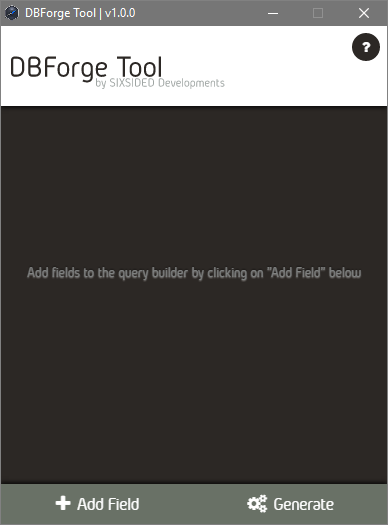
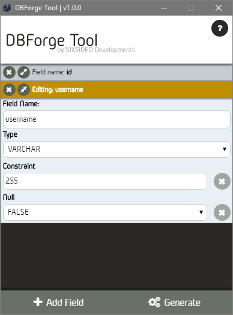
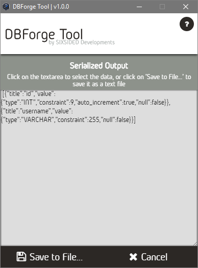

DBForge Tool
============
_A simple tool built to help make field arrays for use in DBForge, on CodeIgniter projects_


## About the tool

**DBForge Tool** is a **NW.js** based tool built to help create table arrays to be used with the `database forge (dbforge)` module on CodeIgniter. In essence, it just helps you build the fields array used when creating a table.

The reason I built this tool is because some code started to become **really** massive on some models to me (specially when I was using more than 4 tables), so I wanted a solution that would lessen the number of lines in the code and, also, let me backup all the table layouts into files (so I could just copy/paste'em, load and rebuild the tables whenever I wanted).

Bear in mind that I'm not a great coder, and this is just a simple tool built to my own needs, so things might require some extra coding for other solutions. The source code is commented as much as possible, but I might have left some things uncommented.

Use this at your own risk! :sweat_smile::sweat_drops:

-----

## How to Use

You should use the binary release or run the source code with **NW.js/Node Webkit**. You can just run this as a web app, but you won't be able to save the generated data in a file.

When opening the app, you're presented with this screen:

|Screen|Description|
|------|-----------|
||When you open the application, you're presented with this screen. Clicking on the "?" button opens the "About" panel.|
||Clicking on the "Add Field" button, adds a single field entity for the database, every field starts minimized. You can click on the field's name and drag it to sort them (recommended doing it with the field minimized), the "X" button to delete the field or expand the field to fill the details on it.<br>The field name and type are always required, but the other fields aren't, so you can just delete'em if you want (you can't add'em later, so carefully think about it, as you'll have to add another field).|
||After filling the field data, you can click on the "Generate" button, which brings you to this screen. You can save the generated JSON data as a file (just a simple text file with the "dbforge" extension) and you can also click on the textarea to select everything and copy it.|

After you've generated the code, this is an example implementation of what you can do with it:

```php
// Reading the content
$file = file_get_contents( "data.dbforge" );

// Decode the JSON into an associative array
$file = json_decode( $file, true );
```

By doing this, you'll have an array containing some nested arrays and values. Each array has:
- **'title'**: a string containing the field name;
- **'value'**: an associative array with the field data values;

-----

#### Example CodeIgniter Model

I've written a simple Gist, containing a dummy model to exemplify how you'd use this class, you can find it here: [https://gist.github.com/yuigoto/f87acc9bea12d0a1a827072f0e1bbb15](https://gist.github.com/yuigoto/f87acc9bea12d0a1a827072f0e1bbb15)

-----

## License

This project is licensed under the terms of the `MIT License`. Please refer to the `LICENSE.md` file for details on it.


## Authors

 * **Fabio Y. Goto** - _code, layout_

-----

<small>
**_&copy;2016 SIXSIDED Developments_**
</small>